# ⚡ Smart Home Energy Monitoring System

<p align="center">
  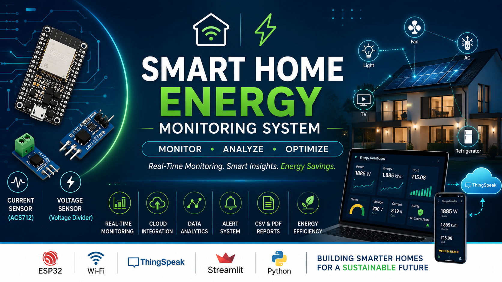
</p>

<p align="center">


</p>

---

# 📌 Overview

The **Smart Home Energy Monitoring System** is an IoT-based solution designed to monitor household energy consumption, estimate electricity costs, generate alerts, and provide real-time analytics through cloud dashboards.

The project combines:

* ⚡ Energy Monitoring
* ☁️ Cloud Integration
* 📊 Data Analytics
* 📈 Visualization Dashboards
* 📄 Automated Reporting
* 🚨 Alert Generation

This system simulates realistic household appliance energy consumption and provides insights that help reduce electricity usage and optimize energy efficiency.

---

# 🎯 Problem Statement

Most households receive electricity usage information only after receiving their monthly bill. This makes it difficult to:

* Identify energy-hungry appliances
* Detect abnormal electricity consumption
* Reduce electricity costs
* Monitor usage in real time

This project solves these challenges by providing continuous monitoring, analytics, and reporting.

---

## 🚀 Live Demo

🔗 https://iot-smart-home-energy-monitoring-system-aetjsyzesktncahzueh9fy.streamlit.app/

---

# ✨ Features

### Energy Monitoring

* Voltage Monitoring
* Current Monitoring
* Power Consumption Tracking
* Energy Consumption Calculation

### Cost Analytics

* Electricity Cost Estimation
* Daily Usage Analysis
* Monthly Usage Analysis

### Cloud Integration

* ThingSpeak Dashboard
* Real-Time Data Upload

### Reporting

* CSV Log Generation
* PDF Report Generation
* Historical Data Storage

### Visualization

* Streamlit Dashboard
* Power Trend Charts
* Energy Trend Charts
* Cost Analysis Charts

### Alerts

* Normal Usage Detection
* Medium Usage Detection
* High Usage Detection

---

# 🏗️ System Architecture

<p align="center">
  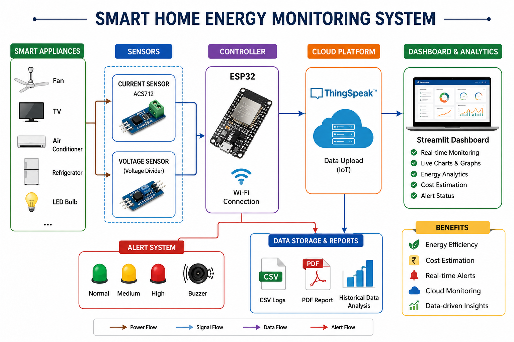
</p>

---

# 🔄 Project Workflow

```text
Smart Appliances
       │
       ▼
Energy Consumption Simulation
       │
       ▼
Energy Calculation Engine
       │
       ▼
Cost Estimation
       │
       ▼
Alert Generation
       │
       ▼
CSV Logging
       │
       ▼
ThingSpeak Cloud
       │
       ▼
Graph Generation
       │
       ▼
PDF Reports
       │
       ▼
Streamlit Dashboard
```

---

# 🛠️ Technology Stack

| Category        | Technology   |
| --------------- | ------------ |
| Programming     | Python       |
| IoT Controller  | ESP32        |
| Cloud Platform  | ThingSpeak   |
| Dashboard       | Streamlit    |
| Data Processing | Pandas       |
| Visualization   | Matplotlib   |
| Reporting       | ReportLab    |
| Version Control | Git & GitHub |

---

# 📂 Project Structure

<p align="center">
  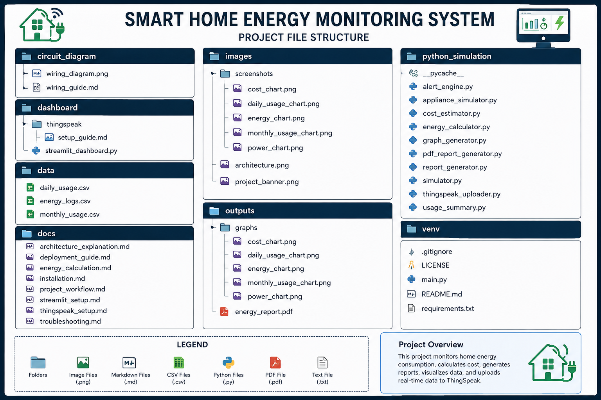
</p>

---

# ⚙️ Installation

## Clone Repository

```bash
git clone https://github.com/VaishnavaDevi-R/IoT-Smart-Home-Energy-Monitoring-System.git

cd Smart-Home-Energy-Monitoring-System
```

## Create Virtual Environment

### Windows

```bash
python -m venv venv
venv\Scripts\activate
```

### Linux / macOS

```bash
python3 -m venv venv
source venv/bin/activate
```

## Install Dependencies

```bash
pip install -r requirements.txt
```

---

# ▶️ Run the Project

```bash
python main.py
```

---

# 📊 Launch Dashboard

```bash
streamlit run dashboard/streamlit_dashboard.py
```

Open:

```text
http://localhost:8501
```

---

# ☁️ ThingSpeak Integration

Create a ThingSpeak Channel with the following fields:

| Field   | Parameter    |
| ------- | ------------ |
| Field 1 | Voltage      |
| Field 2 | Current      |
| Field 3 | Power        |
| Field 4 | Energy       |
| Field 5 | Cost         |
| Field 6 | Alert Status |

Add your Write API Key in:

```python
python_simulation/thingspeak_uploader.py
```

---

# 🔌 Circuit Diagram

<p align="center">
  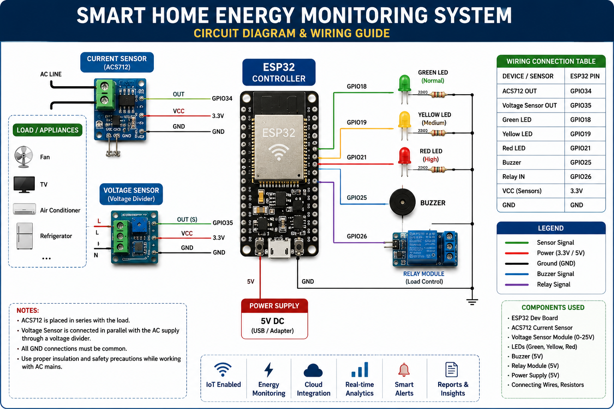
</p>

---

# 📈 Generated Analytics

## Power Consumption

<p align="center">
  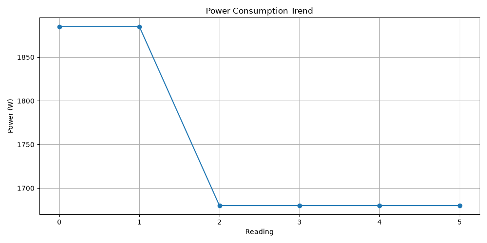
</p>

## Energy Consumption

<p align="center">
  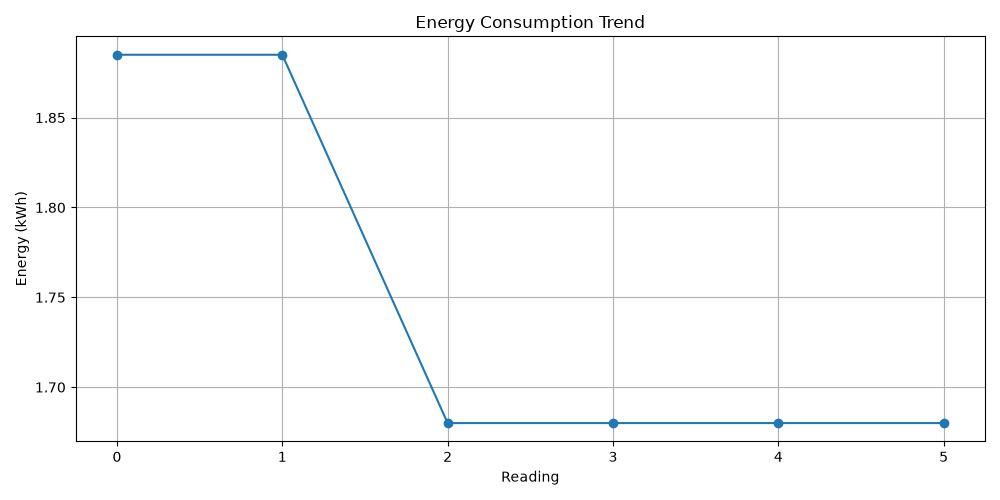
</p>

## Cost Analysis

<p align="center">
  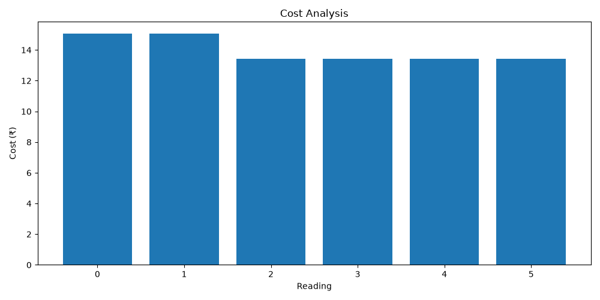
</p>

## Daily Usage

<p align="center">
  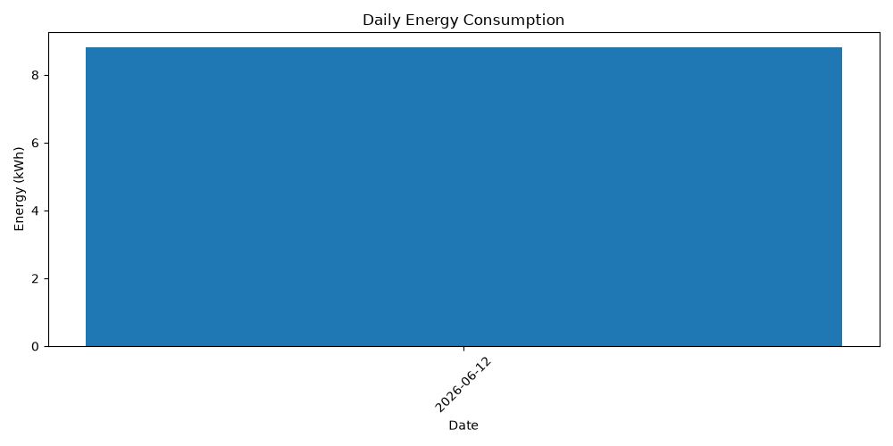
</p>

## Monthly Usage

<p align="center">
  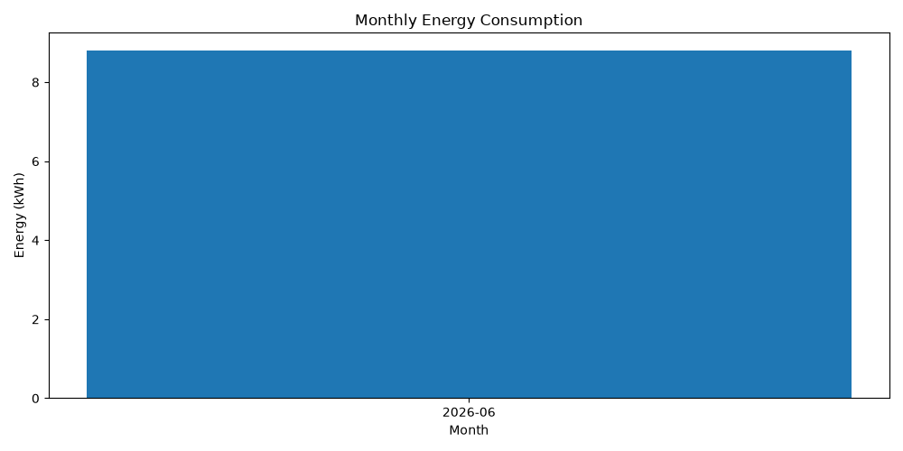
</p>

---

# 🖥️ Dashboard Preview

## Streamlit Dashboard

<p align="center">
  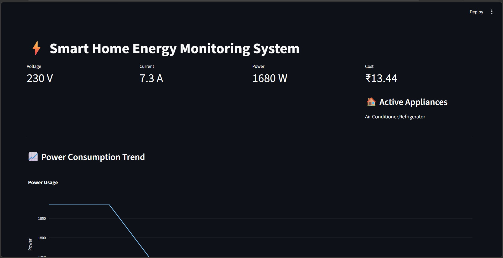
</p>

## Dashboard Overview

<p align="center">
  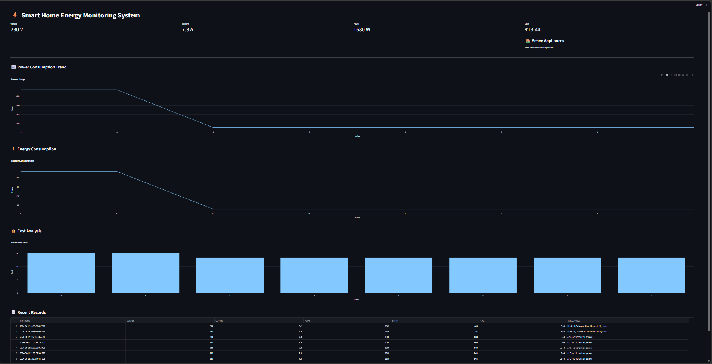
</p>

## ThingSpeak Dashboard

<p align="center">
  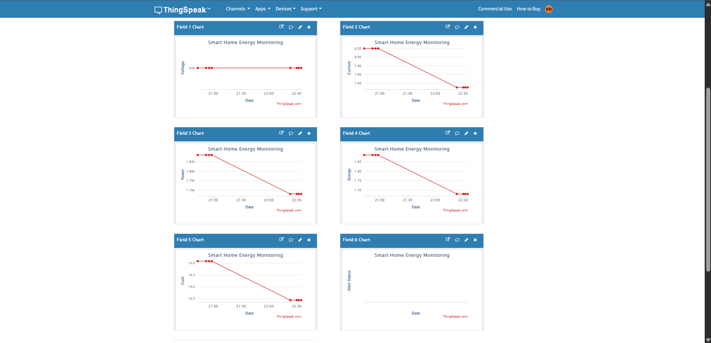
</p>

---

# 📄 Reports & Logs

## CSV Logs

<p align="center">
  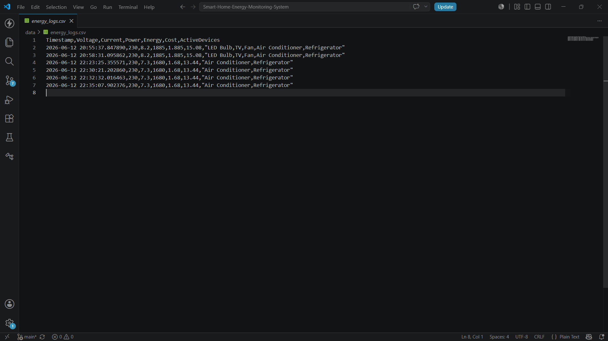
</p>

## PDF Report

<p align="center">
  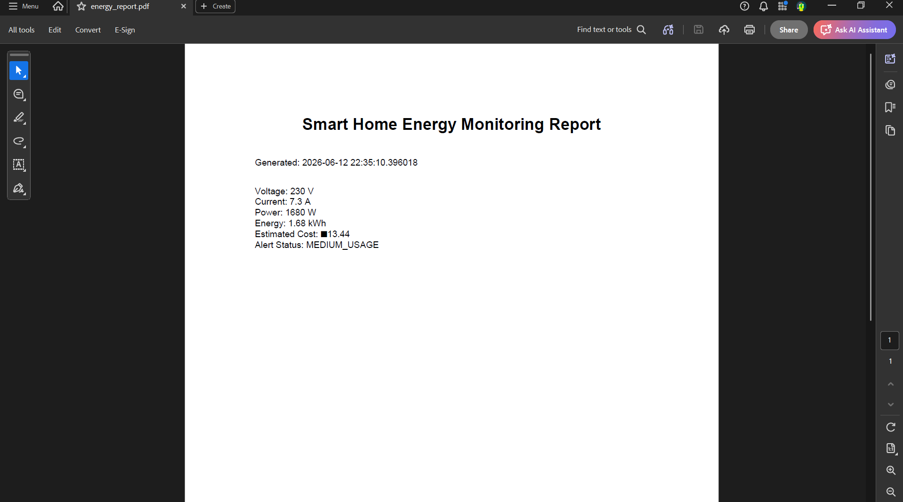
</p>

## Terminal Output

<p align="center">
  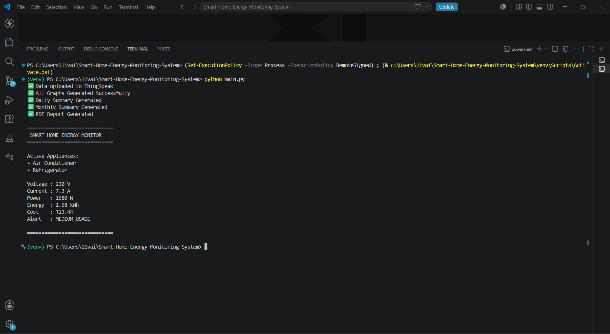
</p>

---

# 📁 Generated Outputs

```text
outputs/
│
├── energy_report.pdf
│
└── graphs/
    ├── power_chart.png
    ├── energy_chart.png
    ├── cost_chart.png
    ├── daily_usage_chart.png
    └── monthly_usage_chart.png
```

---

# 🚀 Future Enhancements

* Real ESP32 Hardware Integration
* MQTT Communication
* Node-RED Automation
* Grafana Analytics
* Home Assistant Integration
* Mobile Application
* AI-Based Energy Prediction
* Appliance Fault Detection
* Smart Load Balancing
* Renewable Energy Monitoring

---

# 🎓 Learning Outcomes

Through this project, you will gain hands-on experience in:

* IoT System Design
* Energy Analytics
* Cloud Computing
* Data Visualization
* Dashboard Development
* Report Generation
* Python Automation
* Smart Home Technologies

---

# 📜 License

This project is licensed under the MIT License.

---

# 👩‍💻 Author

**Vaishnava Devi**

If you found this project useful, consider giving it a ⭐ on GitHub.
